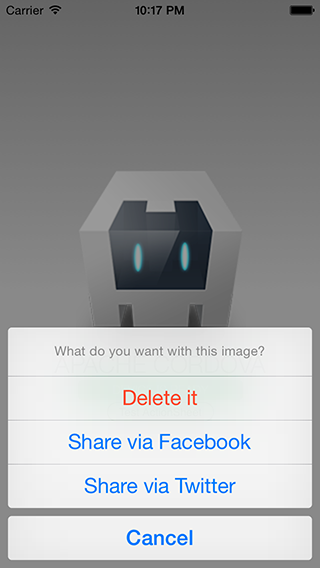
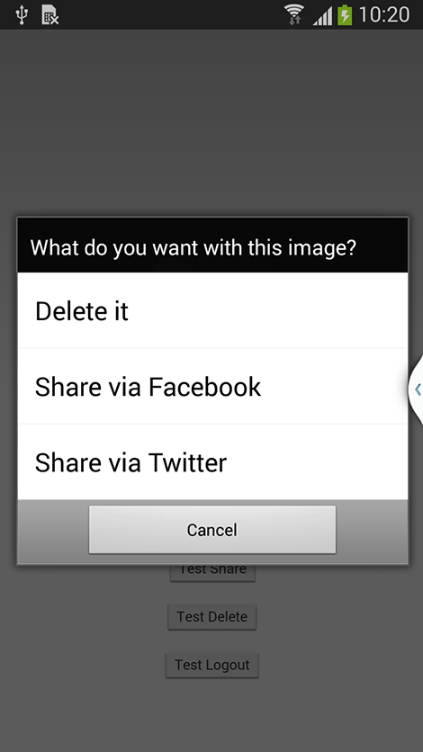

The Action Sheet plugin shows a native sheet of options the user can choose from. iOS uses the native `UIActionSheet`. Android uses the native `AlertDialog`.

```bash
cordova plugin add https://github.com/EddyVerbruggen/cordova-plugin-actionsheet.git
```

#### Methods

##### `show(options)`

| Param        | Type           | Detail  |
| ------------ |----------------| --------|
| options       | `Object`      | Options to configure the Action Sheet |

> | Options                       | Type           | Detail  |
> | ----------------------------  | ---------------| --------|
> | title                         | `String`       | Title of the Action Sheet |
> | buttonLabels                  | `String Array` | Text for each button, index starting from `1` |
> | addCancelButtonWithLabel      | `String`       | If empty, no cancel button. Otherwise sets text of cancel button |
> | androidEnableCancelButton     | `Boolean`      | Enables cancel button for Android, *default `false`* |
> | winphoneEnableCancelButton    | `Boolean`      | Enables cancel button for Windows Phone, *default `false`* |
> | addDestructiveButtonWithLabel | `String`       | Includes a **red** button |

**Returns** `Integer` - the button index user clicked (first button is index 1).


 

#### Example

```javascript

module.controller('ThisCtrl', function($cordovaActionSheet) {
   var options = {
     title: 'What do you want with this image?',
     buttonLabels: ['Share via Facebook', 'Share via Twitter'],
     addCancelButtonWithLabel: 'Cancel',
     androidEnableCancelButton : true,
     winphoneEnableCancelButton : true,
     addDestructiveButtonWithLabel : 'Delete it'
   };

   $cordovaActionSheet
     .show(options)
     .then(function(btnIndex) {
       var index = btnIndex;
     });
});
```