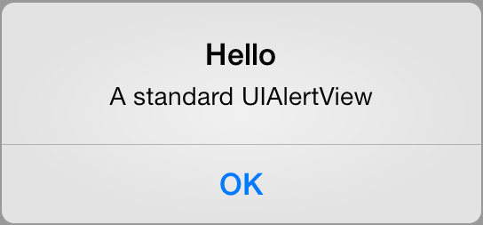
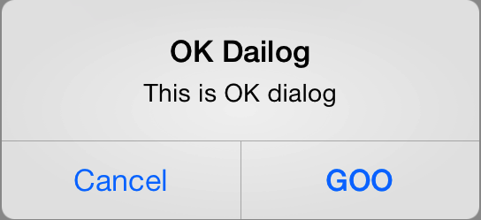
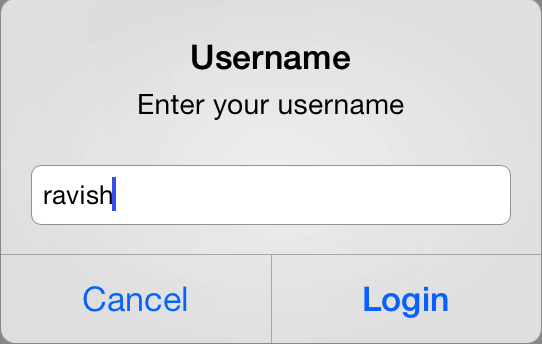

Trigger alert, confirm, and prompt windows, or send beeps (beep, beep!)

```
cordova plugin add org.apache.cordova.dialogs
```

#### Methods

##### `alert(message, title, buttonName)`

| Param        | Type        | Detail  |
| ------------ |-------------| --------|
| message      | `String`    | Message of the Alert dialog |
| title        | `String`    | Title of the dialog *default: `Alert`* |
| buttonName   | `String`    | Name of the button which user clicks to dismiss alert *default: `OK`* |




##### `confirm(message, title, buttonArray)`

| Param        | Type           | Detail  |
| ------------ |----------------| --------|
| message      | `String`       | Message of the Confirm dialog |
| title        | `String`       | Title of the dialog *default: `Confirm`* |
| buttonArray  | `String Array` | Array of buttons to display *default: `['OK', 'Cancel']`* |

**Returns**  `Integer`: `0` - no button, `1` - button 1, `2` - button 2




##### `prompt(message, title, buttonArray, defaultText)`

| Param        | Type           | Detail  |
| ------------ |----------------| --------|
| message      | `String`       | Message of the Prompt dialog |
| title        | `String`       | Title of the dialog |
| buttonArray  | `String Array` | Array of buttons to display |
| defaultText  | `String`       | Default text inside of the prompt input |

**Returns**  `Object` with user input as `result.input1` and button index as `result.buttonIndex`




##### `beep(repetitions)`

| Param        | Type           | Detail  |
| ------------ |----------------| --------|
| repetitions  | `Integer`      | Number of times to sound the beep noise |


#### Example

```javascript
module.controller('MyCtrl', function($scope, $cordovaDialogs) {

  $cordovaDialogs.alert('message', 'title', 'button name')
    .then(function() {
      // callback success
    });

  $cordovaDialogs.confirm('message', 'title', ['button 1','button 2'])
    .then(function(buttonIndex) {
      // no button = 0, 'OK' = 1, 'Cancel' = 2
      var btnIndex = buttonIndex;
    });

  $cordovaDialogs.prompt('msg', 'title', ['btn 1','btn 2'], 'default text')
    .then(function(result) {
      var input = result.input1;
      // no button = 0, 'OK' = 1, 'Cancel' = 2
      var btnIndex = result.buttonIndex;
    });

  // beep 3 times
  $cordovaDialogs.beep(3);

});
```
