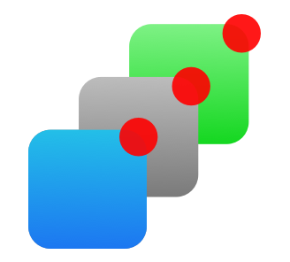
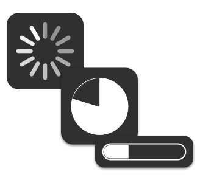

## Plugins Overview

ngCordova comes with over 63 native Cordova plugins that you can easily add to your Angular Cordova apps. Choose the plugin you'd like to use from the menu which will have information on which plugin you need to install, and an example of how to use it in your Angular code.

	

		
		<h3 class="expose-title">Camera</h3>
		
Take pictures and video from your device

		<a class="expose-link" href="/docs/plugins/camera">Learn More <i class="icon ion-ios-arrow-right"></i></a>
	

	

		
		<h3 class="expose-title">Touch ID</h3>
		
Leverage iOS TouchID authentication

		<a class="expose-link" href="/docs/plugins/touchID">Learn More <i class="icon ion-ios-arrow-right"></i></a>
	

	

		
		<h3 class="expose-title">OAuth</h3>
		
Login flow for various OAuth providers

		<a class="expose-link" href="/docs/plugins/oauth">Learn More <i class="icon ion-ios-arrow-right"></i></a>
	

	

		
		<h3 class="expose-title">Push Notifications</h3>
		
Easily handle remote push notifications

		<a class="expose-link" href="/docs/plugins/pushNotifications">Learn More <i class="icon ion-ios-arrow-right"></i></a>
	

	

		
		<h3 class="expose-title">Geolocation</h3>
		
Track location once, or repeatedly

		<a class="expose-link" href="/docs/plugins/geolocation">Learn More <i class="icon ion-ios-arrow-right"></i></a>
	

	

 		
 		<h3 class="expose-title">Progress Indicator</h3>
 		
Indicate loading or downloading

 		<a class="expose-link" href="/docs/plugins/progressIndicator">Learn More <i class="icon ion-ios-arrow-right"></i></a>
 	

